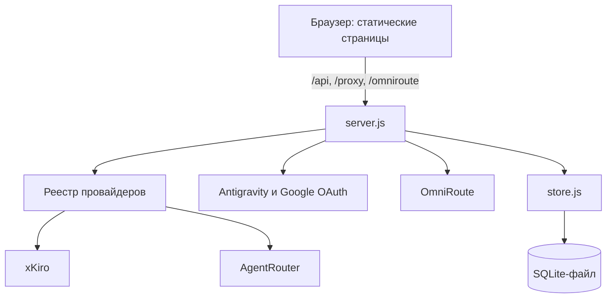
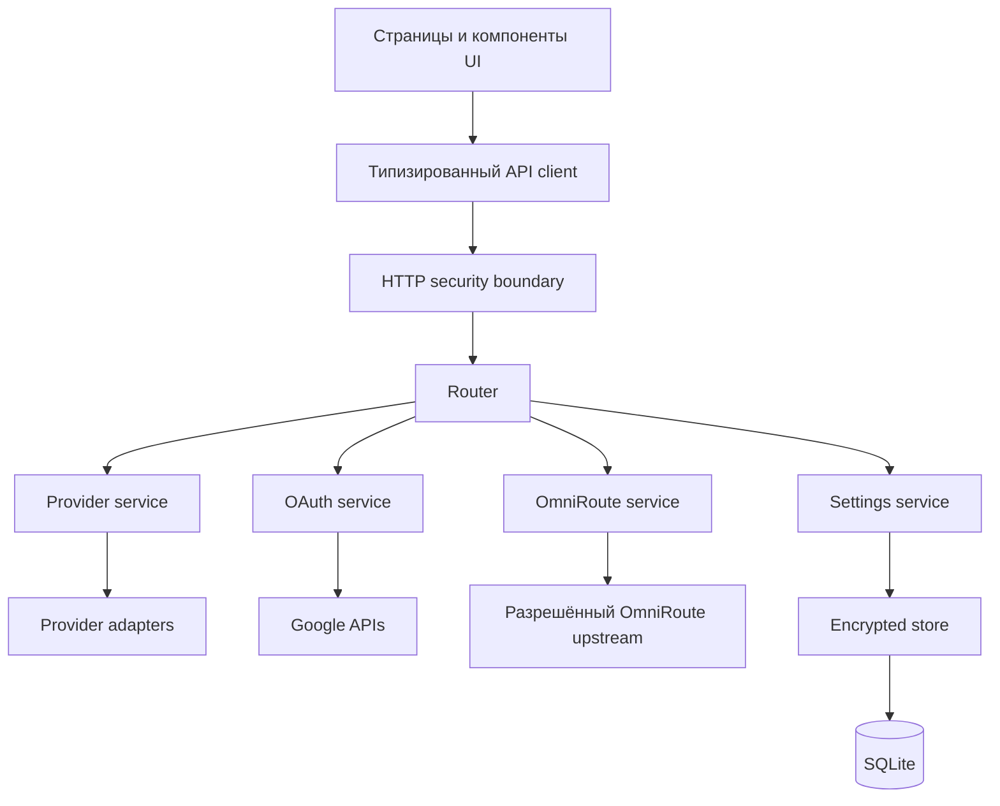
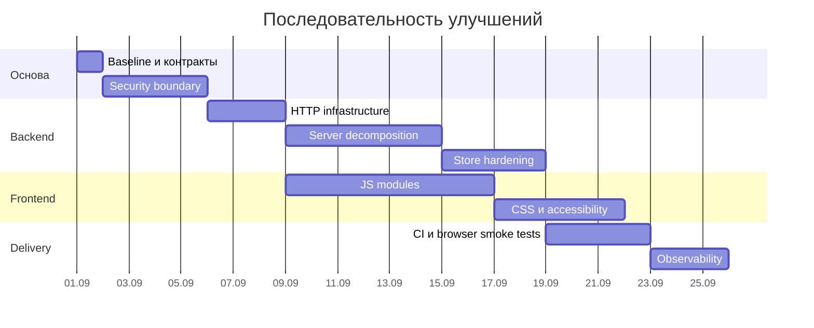

# План улучшений и рефакторинга AI Panel

Дата анализа: 29 августа 2026 г.

## 1. Краткое резюме

AI Panel — локальная Node.js-панель без сборщика, которая:

- показывает статистику и каталоги моделей AI-провайдеров;
- работает с xKiro, AgentRouter и Antigravity/Google OAuth;
- проксирует запросы к провайдерам и OmniRoute;
- хранит настройки и секреты в SQLite через `sql.js`, шифруя значения AES-256-GCM;
- обслуживает несколько статических HTML-страниц с общей логикой на vanilla JavaScript;
- имеет интеграционные и модульные тесты на встроенном `node:test`.

Проект уже имеет хорошие базовые решения: адаптеры провайдеров отделены от HTTP-сервера, внешние API тестируются через mock-upstream, секреты не лежат в базе открытым текстом, запись БД выполняется через атомарную замену файла, а сервер можно создавать через `createApp()` для интеграционных тестов.

Главные ограничения сейчас связаны не с функциональностью, а с границами ответственности и безопасностью:

1. `server.js` объединяет маршрутизацию, OAuth, прокси, статику, валидацию, бизнес-логику и фоновые задачи.
2. `public/app.js` и `public/styles.css` стали монолитами на несколько тысяч строк.
3. API хранилища возвращает клиенту расшифрованный снимок настроек; при доступе панели из сети это раскрывает все сохранённые секреты.
4. OmniRoute URL поступает от клиента и используется сервером как адрес назначения, что создаёт SSRF-риск при сетевом развёртывании.
5. Сетевой режим, CORS, аутентификация панели и модель доверия не зафиксированы явно.
6. Ошибки парсинга и сохранения часто подавляются пустыми `catch`, поэтому интерфейс может сообщить об успехе до фактической записи данных.
7. Документация частично устарела и расходится с кодом.

Рекомендуемый подход — не переписывать сервис целиком, а постепенно выделять модули под защитой существующих контрактных тестов.

## 2. Текущее состояние

### 2.1. Архитектура



Сервер — один процесс Node.js на стандартном `http`. Клиент — несколько HTML-страниц, использующих общие `partials.js`, `app.js` и `styles.css`. Сборка и транспиляция отсутствуют.

### 2.2. Размер и концентрация ответственности

| Файл | Примерный размер | Наблюдение |
|---|---:|---|
| `server.js` | 437 строк | HTTP-инфраструктура, маршруты, OAuth, прокси, статика, cron-подобный трекер |
| `public/app.js` | 1925 строк | состояние, API-клиент, DOM, настройки и логика всех страниц |
| `public/styles.css` | 1790 строк | стили всех страниц и компонентов в одном файле |
| `store.js` | 183 строки | компактный модуль, но требует усиления валидации и жизненного цикла |
| `providers/*.js` | 88–188 строк | наиболее удачно изолированная часть проекта |
| `test/*.js` | 1692 строки | хорошая основа для безопасного пошагового рефакторинга |

### 2.3. Проверка качества

На момент анализа выполнена команда:

```bash
npm test
```

Результат: **65 тестов прошли, 0 упало, 0 пропущено**.

Тесты покрывают провайдеры, реестр, model matching, основные серверные маршруты, прокси и сложный Antigravity/OAuth flow. Покрытие фронтенд-логики, хранилища, сетевой границы и негативных сценариев API настроек ограничено.

## 3. Сильные стороны

- Минимальный runtime-стек и простой запуск на Node.js 18+.
- Инъекция провайдеров и хранилища через `createApp()` упрощает тестирование.
- Адаптеры xKiro и AgentRouter отделены от HTTP-маршрутизации.
- Mock-upstream исключает зависимость тестов от внешних сервисов.
- AES-256-GCM обеспечивает конфиденциальность и контроль целостности значений в БД.
- Атомарная запись `store.db.tmp` → `store.db` снижает риск частично записанного файла.
- Ограничение тела запроса в 2 МБ и защита static path от directory traversal уже присутствуют.
- Есть кеширование Antigravity и автоматическое обновление OAuth access token.
- Используется семантическая разметка: `dialog`, live regions, progressbar ARIA-атрибуты.
- Сервис остаётся достаточно небольшим для последовательного рефакторинга без смены технологического стека.

## 4. Проблемы и рекомендации

### 4.1. P0 — модель безопасности и сетевой периметр

#### 4.1.1. API настроек раскрывает секреты

`GET /api/settings/vault` возвращает расшифрованный `snapshot()` хранилища. В него входят API-ключи, management key OmniRoute, Google OAuth refresh/access token и client secret. Шифрование на диске не защищает эти данные от любого клиента, который может открыть HTTP-порт панели.

**Рекомендация:**

- считать панель локальным приложением и по умолчанию слушать только `127.0.0.1`;
- удалить общий endpoint чтения vault;
- возвращать клиенту только несекретные настройки и признаки `hasKey`/`configured`;
- секретные поля делать write-only: новое значение можно сохранить или удалить, но нельзя прочитать через API;
- если нужен LAN/remote режим, сделать его явным и добавить обязательную аутентификацию сессии.

#### 4.1.2. SSRF через OmniRoute

Клиент передаёт `x-omniroute-url`, а сервер выполняет запрос по этому адресу. При доступе панели извне endpoint можно использовать для обращения к loopback, локальной сети или cloud metadata endpoints.

**Рекомендация:**

- хранить базовый URL OmniRoute только на сервере;
- не принимать произвольный upstream URL на каждом запросе;
- валидировать протокол (`http:`/`https:`), hostname и порт;
- в remote-режиме блокировать loopback, link-local и приватные диапазоны, если они не добавлены в allowlist;
- запретить credentials в URL и нормализовать trailing slash;
- добавить тесты обходов через IPv6, числовые IP и редиректы.

#### 4.1.3. CORS слишком широкий

`Access-Control-Allow-Origin: *` применяется к API и прокси. Вместе с отсутствием аутентификации это расширяет поверхность атаки: сторонняя веб-страница может обращаться к локальной панели из браузера пользователя.

**Рекомендация:**

- для локальной панели не включать CORS по умолчанию;
- принимать только same-origin запросы;
- проверять `Origin` для изменяющих состояние методов;
- разрешать CORS только через явную конфигурацию allowlist;
- добавить `X-Content-Type-Options: nosniff`, CSP, `Referrer-Policy` и `frame-ancestors 'none'`.

#### 4.1.4. OAuth state не проверяется

При создании Google OAuth URL генерируется `state`, но в текущем потоке нет явного сохранения и проверки этого значения при обмене кода.

**Рекомендация:** хранить одноразовый state с коротким TTL, проверять его до обмена кода и инвалидировать после использования. По возможности добавить PKCE.

### 4.2. P1 — корректность и надёжность данных

#### 4.2.1. Валидация master key

`AIPANEL_MASTER_KEY` используется как hex-ключ без предварительной проверки длины и формата. Ошибка проявится позже внутри crypto-операции и будет менее понятной.

**Рекомендация:** при запуске требовать ровно 64 hex-символа, выдавать безопасную диагностическую ошибку и завершать запуск до обслуживания запросов.

#### 4.2.2. Ошибки расшифровки скрываются

`decrypt()` возвращает `null` как для повреждённых данных, так и для неверного master key. `snapshot()` молча пропускает такие записи.

**Рекомендация:** различать отсутствие записи и ошибку расшифровки; при инициализации выполнять проверку служебной контрольной записи; не запускать панель с частично нечитаемым vault без явного предупреждения.

#### 4.2.3. Сохранение настроек не подтверждается клиенту надёжно

`vaultSet()` обновляет локальный кеш до ответа сервера и подавляет сетевые ошибки. Из-за отсутствия проверки `response.ok` интерфейс может считать настройку сохранённой, хотя сервер вернул ошибку или недоступен.

**Рекомендация:**

- сначала дождаться успешного ответа, затем обновлять кеш;
- возвращать/пробрасывать типизированную ошибку;
- показывать пользователю ошибку сохранения;
- для нескольких полей использовать один атомарный batch endpoint.

#### 4.2.4. Некорректный JSON превращается в пустой объект

В нескольких маршрутах ошибка `JSON.parse` подавляется и запрос обрабатывается как `{}`. Это затрудняет диагностику и делает контракты нестрогими.

**Рекомендация:** единый `readJson(req)` должен различать `400 invalid_json`, `413 payload_too_large` и ошибку чтения. Добавить проверку `Content-Type` для JSON-маршрутов.

#### 4.2.5. Жизненный цикл хранилища не завершён

Хранилище не предоставляет `close()`/`flush()`, а сервер не имеет централизованного graceful shutdown. Фоновый interval также требует явной остановки.

**Рекомендация:** добавить `app.closeResources()` или сервисный lifecycle: остановить timers, дождаться очереди записи, закрыть DB и HTTP server на `SIGINT`/`SIGTERM`.

### 4.3. P1 — архитектура сервера

`server.js` содержит:

- загрузчик `.env`;
- static file server;
- body reader;
- generic provider proxy;
- OmniRoute proxy;
- все API-маршруты;
- Google OAuth flow;
- работу с vault;
- бизнес-расчёт суточной дельты AgentRouter;
- запуск фонового interval;
- CLI entrypoint.

Это затрудняет локальные изменения и делает обработку ошибок неоднородной.

**Целевая структура без нового фреймворка:**

```text
src/
├── app.js                  # композиция зависимостей и createApp
├── config.js               # env, host, port, security mode
├── http/
│   ├── router.js           # таблица маршрутов
│   ├── body.js             # лимит и JSON parsing
│   ├── response.js         # json/error/noContent
│   ├── errors.js           # AppError и маппинг кодов
│   ├── security.js         # origin/CORS/security headers
│   └── static.js           # статические файлы
├── routes/
│   ├── providers.js
│   ├── settings.js
│   ├── antigravity-auth.js
│   └── omniroute.js
├── services/
│   ├── provider-service.js
│   ├── agentrouter-tracker.js
│   └── oauth-service.js
├── proxy/
│   ├── provider-proxy.js
│   └── omniroute-proxy.js
├── store/
│   ├── encrypted-store.js
│   └── schema.js
└── main.js                 # сигналы, listen, logging
```

На первом шаге можно оставить CommonJS и отсутствие сборки. Переход на TypeScript или фреймворк не нужен для решения текущих проблем.

### 4.4. P1 — архитектура фронтенда

`public/app.js` обслуживает все страницы и содержит глобальное состояние, API-запросы, DOM-ссылки, рендер, настройки, OAuth, combo, модели и таймеры. Из-за этого каждая страница загружает лишнюю логику, а тестирование функций затруднено.

**Целевая структура на нативных ES modules:**

```text
public/js/
├── main.js
├── core/
│   ├── api-client.js
│   ├── state.js
│   ├── dom.js
│   ├── errors.js
│   └── format.js
├── components/
│   ├── settings-dialog.js
│   ├── banner.js
│   ├── topbar.js
│   └── progress.js
├── pages/
│   ├── statistics.js
│   ├── models.js
│   ├── combo.js
│   └── cheatsheet.js
└── services/
    ├── providers-api.js
    ├── settings-api.js
    ├── antigravity-api.js
    └── omniroute-api.js
```

**Принципы:**

- одна точка входа определяет страницу через `data-page`;
- API-клиент централизованно проверяет статус, JSON и timeout;
- чистые formatter/model-matching функции не зависят от DOM;
- обработчики страницы создаются и уничтожаются явно;
- секреты не кешируются в браузерном объекте после сохранения;
- пустые `catch {}` заменяются ожидаемой обработкой или логированием.

### 4.5. P2 — стили и UI-поддерживаемость

`styles.css` вырос до 1790 строк и объединяет токены, layout, компоненты, страницы и адаптивность.

**Рекомендация:** разделить без введения препроцессора:

```text
public/css/
├── tokens.css
├── base.css
├── layout.css
├── components.css
├── dialog.css
├── pages/statistics.css
├── pages/models.css
├── pages/combo.css
└── utilities.css
```

Подключать общие стили на всех страницах, а page stylesheet — только там, где он нужен. Сохранить текущие CSS custom properties и визуальное поведение.

### 4.6. P2 — тестирование и качество

Существующая тестовая база сильна для размера проекта, но не закрывает критические новые границы.

**Добавить:**

- unit-тесты `store.js`: неверный ключ, tampering, повторное открытие, конкурентные записи, ошибка persist;
- контрактные тесты всех API-маршрутов: методы, schema, invalid JSON, 413, unknown route;
- security-тесты Origin/CORS, write-only secrets и SSRF allowlist;
- тесты lifecycle: interval очищается, pending write завершается при shutdown;
- тесты OAuth state/TTL/replay;
- тесты чистых frontend-функций через `node:test`;
- несколько browser smoke/e2e-тестов для настройки, статистики, моделей и combo.

Полноценный browser runner можно добавить позже. До декомпозиции полезнее сначала вынести чистую логику так, чтобы она тестировалась встроенным `node:test` без DOM.

### 4.7. P2 — наблюдаемость

Сейчас логи создаются точечно через `console.log/error`, а upstream error message может напрямую попадать клиенту.

**Рекомендация:**

- единый структурированный logger с уровнями;
- request ID для входящего запроса и связанных upstream-вызовов;
- фиксированный JSON error contract: `code`, `message`, опционально `requestId`;
- не отдавать клиенту сырые внутренние ошибки сети;
- маскировать authorization, API keys, OAuth code/token и query params;
- логировать provider, route, status и duration без секретов;
- добавить `/api/health` и `/api/ready`.

### 4.8. P2 — документация и конфигурация

README расходится с реализацией:

- начало `server.js` всё ещё говорит о ключах в `localStorage`, хотя появился серверный vault;
- раздел OmniRoute утверждает, что URL/ключ хранятся в `localStorage`;
- дерево файлов содержит отсутствующий `manage.html` и не полностью отражает текущие файлы;
- `package.json` содержит зависимость `sql.js`, а README говорит, что зависимостей нет;
- описания `.env` и модели хранения требуют синхронизации.

**Рекомендация:**

- обновить README после стабилизации security contract;
- добавить `.env.example` с `HOST`, `PORT`, `AIPANEL_MASTER_KEY` и комментариями;
- документировать локальный и remote режимы отдельно;
- описать backup/restore пары `store.db` + master key;
- добавить краткую таблицу API и error codes;
- удалить устаревшие комментарии из кода.

### 4.9. P3 — функциональное развитие

Функциональные пункты из текущего README стоит выполнять после стабилизации основы:

1. AgentRouter: модели и окна расхода.
2. Уведомления при приближении к лимитам.
3. Несколько аккаунтов и ключей.
4. Управление dev-процессами.

Особенно рискован пункт управления процессами: он добавляет выполнение команд с сервера и не должен появляться до реализации аутентификации, allowlist команд, журналирования и локального режима по умолчанию.

## 5. Целевая архитектура



Ключевая граница: браузер получает отображаемые данные и статусы конфигурации, но никогда не получает сохранённые секреты обратно.

## 6. Этапы реализации

### Этап 0. Зафиксировать baseline и решения

**Статус:** ✅ выполнен 2026-08-29.

**Цель:** сделать последующие изменения измеримыми и избежать случайной смены поведения.

**Работы:**

- [x] зафиксировать поддерживаемую версию Node.js (`.nvmrc`, `package.json`, `docs/BASELINE.md`);
- [x] описать текущие API endpoint, методы и error payloads (`docs/BASELINE.md`);
- [x] определить официальный режим: local-only по умолчанию, remote — только явно (`docs/DECISIONS.md`);
- [x] решить, нужен ли вообще режим `file://` после перехода на server-side vault — режим не поддерживается;
- [x] добавить `test:unit`, `test:integration` и общий `test` скрипты;
- [x] описать тестовую стратегию и mock boundaries (`docs/TESTING.md`).
- [x] документировать текущий стиль и отложенное введение lint/format (`docs/TESTING.md`);
- [x] измерить тестовое покрытие встроенным `node --test --experimental-test-coverage`: 95,23% строк / 81,94% ветвей / 90,13% функций.

**Критерии готовности:**

- [x] `npm test` остаётся зелёным: 64/64;
- [x] API contract сохранён в документации;
- [x] принято и записано решение о local/remote модели.

**Оценка:** 0,5–1 день.

### Этап 1. Закрыть критические риски безопасности

**Статус:** ✅ выполнен 2026-08-29.

**Цель:** безопасная граница даже до архитектурного рефакторинга.

**Работы:**

- [x] слушать `127.0.0.1` по умолчанию через явный `HOST`; для reverse proxy `PUBLIC_ORIGIN` явно включает bind на `0.0.0.0`;
- [x] заменить wildcard CORS на same-origin/allowlist;
- [x] добавить security headers;
- [x] убрать выдачу полного vault, ввести публичную DTO конфигурации;
- [x] сделать секреты write-only;
- [x] перенести OmniRoute URL полностью на сервер и валидировать его;
- [x] проверить OAuth state и защититься от replay;
- [x] валидировать `AIPANEL_MASTER_KEY` на старте;
- [x] добавить security regression tests.

**Критерии готовности:**

- [x] ни один GET endpoint не возвращает сохранённые ключи, refresh token или client secret;
- [x] запрос с чужим `Origin` отклоняется;
- [x] произвольный OmniRoute target нельзя передать в запросе;
- [x] OAuth callback с неверным/reused state отклоняется;
- [x] тесты подтверждают local-only default.

**Оценка:** 2–4 дня.

### Этап 2. Ввести общую HTTP-инфраструктуру

**Статус:** ✅ выполнен 2026-08-29.

**Цель:** унифицировать поведение маршрутов до их переноса.

**Работы:**

- [x] выделить `readBody`/`readJson` (`http.js`);
- [x] выделить `sendJson`, `sendError`, `sendNoContent` (`http.js`);
- [x] ввести `AppError` и централизованный error boundary;
- [x] внедрить простой декларативный router (`router.js`; маршруты могут мигрировать инкрементально без собственных error boundaries);
- [x] добавить request ID, timeout и безопасное логирование;
- [x] стандартизировать 400/404/405/413/502 через общую инфраструктуру; provider-specific 401/403 сохраняются как контракт адаптеров.

**Критерии готовности:**

- [x] API-маршруты используют общие JSON/error helpers и централизованный boundary;
- [x] malformed JSON всегда возвращает 400;
- [x] большие тела всегда возвращают 413;
- [x] centralized boundary не возвращает stack trace/upstream message клиенту;
- [x] существующие интеграционные тесты проходят.

**Оценка:** 2–3 дня.

### Этап 3. Декомпозировать сервер

**Статус:** ✅ выполнен 2026-08-30.

**Цель:** оставить `createApp()` композицией модулей, а не набором бизнес-веток.

**Порядок переноса:**

1. static serving и generic provider proxy;
2. provider routes;
3. settings routes/service;
4. Antigravity OAuth routes/service;
5. OmniRoute proxy/service;
6. AgentRouter daily tracker;
7. CLI startup и graceful shutdown.

Каждый перенос выполнять отдельным небольшим изменением с сохранением тестов.

**Критерии готовности:**

- [x] `server.js` заменён компактными `src/app.js` и `src/main.js` (сам `server.js` оставлен как точка входа-shim в 4 строки, чтобы деплой продолжал запускать `node server.js`; логики в нём нет);
- [x] route modules не обращаются напрямую к process env или файловой системе (env читает только композиционный корень `src/app.js`, fs — только `src/static.js`);
- [x] сервисы получают зависимости через параметры (`src/antigravity-service.js`, `src/agentrouter-tracker.js`, модули в `src/routes/`);
- [x] timer и store закрываются через lifecycle API (`server.close()` останавливает трекер и вызывает `store.close()`, когда тот появится на этапе 4);
- [x] smoke-запуск и все интеграционные тесты проходят (42 unit + 36 integration).

**Оценка:** 4–6 дней.

### Этап 4. Усилить encrypted store

**Статус:** ✅ выполнен 2026-08-30.

**Цель:** предсказуемое хранение и восстановление настроек.

**Работы:**

- [x] вынести криптографию и persistence в отдельные компоненты (`src/store/`: `crypto.js`, `master-key.js`, `persistence.js`, фасад `index.js`);
- [x] добавить проверочную запись master key (`__verify`, legacy-базы мигрируют при первом успешном открытии);
- [x] различать not-found, corrupted и wrong-key (ошибки при открытии, а не пустые настройки; `get` отсутствующего ключа → `null`);
- [x] ввести schema/allowlist ключей вместо произвольного KV API (`STORE_KEYS`, `unknown_key`);
- [x] реализовать batch transaction на уровне сервиса (`setMany`, используется в `PUT /api/config`);
- [x] добавить `flush()` и `close()` (идемпотентный close, очередь атомарных записей: tmp + rename);
- [x] документировать backup/restore и ротацию ключа (`docs/STORE.md`, CLI `node src/store/rotate-key.js`);
- [x] рассмотреть переход на нативный SQLite — решение: остаёмся на sql.js, обоснование в ADR-004 (docs/DECISIONS.md).

**Критерии готовности:**

- [x] повреждение записи и неверный ключ обнаруживаются явно (`corrupted` / `wrong_key` при открытии, сервер завершается с кодом 1 и понятным сообщением);
- [x] частично сохранённый набор настроек невозможен (`setMany` — батч-транзакция);
- [x] произвольное имя ключа нельзя записать через публичный API;
- [x] есть unit-тесты повторного открытия и конкурентных записей (13 тестов в `test/store.test.js`).

**Оценка:** 2–4 дня.

### Этап 5. Разделить frontend JavaScript

**Статус:** ✅ выполнен 2026-08-30 (визуальную регрессию проверить в браузере после деплоя).

**Цель:** изолировать общую инфраструктуру и page-specific поведение без добавления тяжёлого фреймворка.

**Работы:**

- [x] перейти на `<script type="module">` (entry каждой страницы — `js/pages/<page>.js`, модульный граф без сборки);
- [x] вынести API client и settings client (`js/api.js`, `js/settings.js`);
- [x] вынести formatters и model matching как чистые модули (`js/formatters.js`, `model-match.js` — unit-тесты);
- [x] выделить settings dialog, banner и topbar (`js/dialog.js`, `js/banner.js`, `js/topbar.js`);
- [x] перенести страницы по одной: Models → Combo → Statistics → Cheatsheet (`js/pages/`);
- [x] удалить глобальные изменяемые ссылки на DOM: страничные ссылки локальны, общее состояние — `js/session.js`, обмен через мини-шину `js/events.js`;
- [x] перестать подавлять ошибки сохранения/загрузки (ошибка батч-сохранения показывается в диалоге; недоступность API — баннером и в консоль);
- [x] убрать секреты из browser cache после отправки (поля ключей очищаются после успешного сохранения; пустое поле секрета = «не изменять»).

**Критерии готовности:**

- [x] у каждой страницы отдельный entry/controller;
- [x] изменение Models не требует загрузки или понимания Antigravity/Combo логики (странице «Модели» нужен только каталог и метки combo);
- [x] API ошибки показываются единообразно (баннер для загрузок, dlg-result для сохранения);
- [x] чистая логика имеет unit-тесты (`test/formatters.test.js`, `test/model-match.test.js`);
- [ ] функциональность страниц не изменилась визуально — требуется ручная проверка светлой/тёмной темы и всех 4 страниц после деплоя.

**Оценка:** 5–8 дней.

### Этап 6. Разделить CSS и провести UI/a11y regression

**Статус:** ✅ выполнен 2026-09-03 (первый срез терял 71 класс — восстановлено из styles.css @ 9ac1b32; визуальную проверку в браузере по-прежнему рекомендуется повторить).

**Цель:** снизить стоимость визуальных изменений и сохранить доступность.

**Работы:**

- [x] выделить tokens/base/layout/components/pages (+ dialogs, responsive);
- [x] проверить полноту переноса: скрипт сверки классов (147 из styles.css) — 0 потерь после восстановления;
- [x] проверить keyboard navigation, focus-visible и dialog flow;
- [x] проверить контраст, reduced motion, touch targets и мобильные breakpoints;
- [x] унифицировать loading/empty/error/success состояния;
- [x] провести визуальную проверку светлой и тёмной тем.
- [x] stylelint проходит на всех файлах (`stylelint-config-recommended` добавлен, `no-descending-specificity` отключён — порядок секций оригинала сохранён намеренно).

**Критерии готовности:**

- page-specific стили не влияют на соседние страницы;
- все действия доступны с клавиатуры;
- focus не теряется после закрытия диалога;
- нет горизонтального overflow на целевых ширинах;
- обе темы сохраняют читаемость и состояния фокуса.

**Оценка:** 3–5 дней.

### Этап 7. Расширить автоматическую проверку

**Статус:** 🟡 основной объём выполнен 2026-09-03; не закрыты порог покрытия и аудит зависимостей.

**Цель:** превратить рефакторинг в устойчивый процесс.

**Работы:**

- [x] добавить CI на поддерживаемых версиях Node.js (`.github/workflows/ci.yml`: matrix 20/22 — lint, stylelint, tests; отдельный job с Playwright smoke);
- [x] запускать lint, tests (ESLint переведён на flat config для v10 — прежний `.eslintrc.js` не работал; stylelint-скрипт починен для Windows; `npm run test:coverage` доступен локально);
- [x] добавить browser smoke-тесты основных пользовательских потоков (`tests/playwright/smoke.spec.js`: 4 страницы + переключатель темы — 5/5 проходят; theme-тест учитывает системную тему);
- [ ] установить разумные coverage thresholds сначала только для новых модулей;
- [ ] добавить dependency audit и проверку утечки секретов;
- [ ] проверять документацию/пример env на актуальность.

**Критерии готовности:**

- pull request не проходит при нарушении API/security regression;
- smoke-тесты открывают все страницы и выполняют ключевые сценарии;
- новые модули имеют согласованный порог покрытия;
- CI не использует реальные внешние API и секреты.

**Оценка:** 2–4 дня.

### Этап 8. Наблюдаемость и эксплуатация

**Статус:** ✅ выполнен 2026-09-03.

**Цель:** облегчить диагностику без раскрытия чувствительных данных.

**Работы:**

- [x] структурированные события старта, запроса, upstream и shutdown (requestId в логах, файловый логгер);
- [x] `/api/health` и `/api/ready` (ready проверяет store, tracker, antigravity);
- [x] timeout/retry policy для внешних GET-запросов (`src/fetch-utils.js`: таймаут + ретраи; подключено в `providers/xkiro.js`, `providers/agentrouter.js`, `providers/antigravity.js`; детали не-JSON — статус/content-type/сниппет через `AppError.details`); прокси `/proxy` и `/omniroute` сохраняет собственную политику (таймаут 30 с на весь стрим + отмена при обрыве клиента);
- [x] метрики длительности и ошибок по провайдерам без ключей и payload (`res.on('finish')` → `recordRequest`, `GET /api/metrics`);
- [x] runbook для неверного master key, повреждённой БД, OAuth invalid_grant и недоступного upstream (`docs/RUNBOOK.md`).

**Критерии готовности:**

- по request ID можно проследить ошибку до upstream;
- логи проходят тест на отсутствие секретов;
- readiness отражает готовность store;
- shutdown не теряет ожидающие записи.

**Оценка:** 2–3 дня.

### Этап 9. Развивать функции

**Статус:** 🟡 начат 2026-09-03 (пункт 1 выполнен).

**Цель:** добавлять возможности уже на стабильной архитектуре.

**Порядок:**

1. ✅ AgentRouter models/usage windows как расширение адаптера (реализовано, [RFC-0001](RFC-0001-agentrouter-models.md)).
2. Пороговые уведомления как отдельный notification service.
3. Несколько аккаунтов через сущности `account` и `credential`, а не новые KV-поля.
4. Управление процессами — только local-only, с allowlist команд и аудитом.

**Критерии готовности:** определяются отдельным RFC/issue для каждой функции; security-модель предыдущих этапов не обходится.

## 7. Приоритетный backlog

| Приоритет | Задача | Эффект | Сложность |
|---|---|---|---|
| P0 | Bind на `127.0.0.1` по умолчанию | Закрывает случайную публикацию панели | Низкая |
| P0 | Убрать чтение секретов через vault API | Предотвращает раскрытие ключей | Средняя |
| P0 | Убрать клиентский OmniRoute target | Закрывает основной SSRF-вектор | Средняя |
| P0 | Origin/CORS policy | Защищает локальный API от чужих сайтов | Средняя |
| P0 | Проверка OAuth state | Защищает OAuth flow | Средняя |
| P1 | Валидация master key | Ранний и понятный fail-fast | Низкая |
| P1 | Единый JSON/error layer | Улучшает API и диагностику | Средняя |
| P1 | Надёжный `vaultSet` и batch save | Исключает ложный успех и partial save | Средняя |
| P1 | Декомпозиция `server.js` | Снижает связанность | Высокая |
| P1 | Store lifecycle и integrity check | Повышает сохранность данных | Средняя |
| P1 | Разделение `public/app.js` | Ускоряет развитие UI | Высокая |
| P2 | Тесты security/store/frontend | Предотвращает регрессии | Средняя |
| P2 | Разделение CSS | Снижает визуальные регрессии | Средняя |
| P2 | Structured logging и health checks | Упрощает эксплуатацию | Средняя |
| P2 | Обновление README и `.env.example` | Устраняет ошибки настройки | Низкая |
| P3 | Новые функции из roadmap | Расширяет продукт | Зависит от функции |

## 8. Что не следует делать сейчас

- Не переписывать frontend на React/Vue только ради уменьшения размера `app.js`.
- Не переходить на TypeScript одновременно с разбиением сервера и изменением API.
- Не заменять `sql.js` до появления измеримых проблем производительности или конкурентности.
- Не делать один большой pull request со всей новой структурой.
- Не добавлять управление shell-процессами до закрытия сетевого периметра.
- Не хранить master key рядом с БД в production/remote режиме без отдельного документированного решения по секретам.

## 9. Рекомендуемая последовательность поставки



Backend и frontend декомпозицию можно выполнять параллельно после фиксации HTTP-контрактов. Ориентировочный объём для одного разработчика — **4–7 недель**, включая тестирование и документацию, без новых продуктовых функций.

## 10. Definition of Done всего плана

План можно считать реализованным, когда:

- панель безопасно работает в local-only режиме по умолчанию;
- remote-доступ нельзя включить без явной конфигурации и защиты;
- секреты не возвращаются браузеру после сохранения;
- upstream OmniRoute нельзя произвольно выбрать из HTTP-запроса;
- OAuth state проверяется;
- HTTP-ошибки имеют единый контракт;
- сервер, store и timers корректно завершаются;
- серверная и клиентская логика разбита по ответственности;
- критические security/store/API сценарии покрыты тестами;
- CI запускает проверки без реальных внешних сервисов;
- README соответствует фактическому запуску, хранению и API;
- все исходные пользовательские сценарии остаются рабочими.
