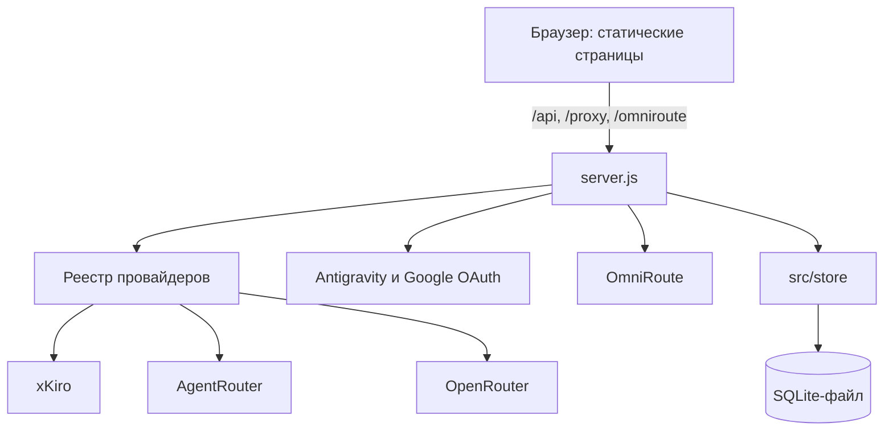

# AI Панель

Дашборд для управления AI-разработкой: статистика потребления и остатков **xKiro** и баланса **AgentRouter** одной строкой, каталог моделей, combo OmniRoute и управление — отдельными страницами с общей навигацией.

## Возможности

**Управление Combo (OmniRoute)** — в IDE достаточно указать одну модель с именем Combo из OmniRoute, а панель удалённо управляет порядком моделей внутри него. Выбираете нужный combo из списка, видите все targets и их веса, ставите приоритетную модель на первое место — и OmniRoute сразу начинает маршрутизировать запросы на неё. Переключение модели в IDE не требуется. Ниже — таблица «Последние combo-запросы»: какая модель реально ответила на каждый запрос через combo.

**Статистика провайдеров** — мониторинг потребления и лимитов: баланс кошелька, зарезервированные средства, окна расхода (короткое ~5 ч и длинное ~7 д) с обратным отсчётом до сброса, бесплатные токены (xKiro), квоты по моделям Google AI Pro (Antigravity), баланс кошелька AgentRouter.

**Каталог моделей** — просмотр доступных моделей провайдера с ценами ($/1M токенов), тирами доступа (free / paid / premium) и контекстным окном. Поиск по имени, переключение между провайдерами.

- **Навигация** — четыре страницы с общей шапкой: **Статистика** (главная), **Combo**, **Модели** и **Управление**
- **Настройки** — диалог в шапке: ввод API-ключа xKiro, токен Antigravity (OAuth), URL и ключ OmniRoute, алиасы имён провайдеров. Секреты хранятся в зашифрованном серверном хранилище.
<br><br>

| | |
|---|---|
| [](public/assets/imgs/AI%20Панель%20—%20Статистика.png) | [](public/assets/imgs/Combo%20·%20AI%20Панель.png) |
| [](public/assets/imgs/AI%20Панель%20—%20Настройки.png) | [](public/assets/imgs/Модели%20·%20AI%20Панель.png) |

## Запуск

### Вариант А — через локальный сервер (рекомендуется)

Официальная версия для разработки — Node.js 22 LTS (`.nvmrc`); минимально поддерживается Node.js 18.

```
node server.js
# или
npm start
```

Откройте http://localhost:8765 — сервер отдаёт статику и проксирует запросы к API (обход CORS).

Порт можно поменять: `PORT=9000 node server.js`.

Прямой запуск через `file://` не поддерживается: интерфейс зависит от серверного API и encrypted vault.

Панель работает и без OmniRoute, но странице **Combo** нужен отдельно установленный OmniRoute — см. раздел [«Combo (OmniRoute)»](#combo-omniroute).

### Вариант Б — за reverse proxy

Если reverse proxy работает в другом контейнере или сетевом namespace, задайте публичный origin:

```env
PUBLIC_ORIGIN=https://ai-panel.home.ak-vps.ru
```

`PUBLIC_ORIGIN` автоматически включает bind на `0.0.0.0`; `HOST` можно задать отдельно. Reverse proxy должен передавать `Host`, `X-Forwarded-Host` и `X-Forwarded-Proto`. Для одного origin `ALLOWED_ORIGINS` не требуется — он считается same-origin.

Пример Nginx/OpenResty:

```nginx
proxy_set_header Host $host;
proxy_set_header X-Forwarded-Host $host;
proxy_set_header X-Forwarded-Proto $scheme;
proxy_pass http://ai-panel:8765;
```

### Вариант В — через PM2 (фоновый демон)

Установите PM2 глобально: `npm install -g pm2`.

```
# Запуск
pm2 start server.js --name ai-panel

# Полезные команды
pm2 status              # статус процессов
pm2 logs ai-panel       # логи в реальном времени
pm2 restart ai-panel    # перезапуск
pm2 stop ai-panel       # остановка
pm2 delete ai-panel     # удаление из списка
pm2 save                # сохранить список процессов
pm2 startup              # автозапуск при перезагрузке системы (по инструкции PM2)
```

Порт задаётся через `.env` или переменную окружения: `PORT=9000 pm2 start server.js --name ai-panel`.

## Деплой на Ubuntu-сервер

Сценарий: `git pull` на сервере → установка прод-зависимостей → перезапуск PM2.

**Первый раз (один раз на сервере)**

```bash
# Установить Node.js через nvm
curl -o- https://raw.githubusercontent.com/nvm-sh/nvm/v0.40.1/install.sh | bash
source ~/.bashrc
nvm install 22

# PM2 глобально
npm install -g pm2

# Клонировать репозиторий
git clone https://github.com/ak-flash/ai-panel-omniroute.git /home/user/ai-panel
cd /home/user/ai-panel

# Создать .env с секретами (шаблон ниже в разделе «Настройка»)
nano .env

# Установить только production-зависимости
npm ci --omit=dev

# Запустить и сохранить в автозапуск
pm2 start server.js --name ai-panel
pm2 save
pm2 startup   # выполнить команду, которую выведет PM2
```

**Обновление до новой версии**

```bash
ssh user@your-server
cd /home/user/ai-panel

git pull
npm ci --omit=dev
pm2 restart ai-panel --update-env
pm2 logs ai-panel --lines 30   # убедиться, что стартовало без ошибок
```

**Откат** (если что-то пошло не так):

```bash
git log --oneline -5            # найти нужный коммит
git checkout <commit>           # откатиться
npm ci --omit=dev
pm2 restart ai-panel --update-env
```

## Настройка (.env)

Скопируйте `.env.example` в `.env` и заполните:

| Переменная | По умолчанию | Описание |
|---|---|---|
| `HOST` | `127.0.0.1` или `0.0.0.0` при `PUBLIC_ORIGIN` | Адрес прослушивания |
| `PUBLIC_ORIGIN` | _(пусто)_ | Внешний `https://` origin reverse proxy; явно включает remote deployment |
| `PORT` | `8765` | Порт локального сервера |
| `ALLOWED_ORIGINS` | _(пусто)_ | Явный CORS allowlist браузерных origins через запятую |
| `AIPANEL_MASTER_KEY` | генерируется локально | Необязательный переносимый master key: ровно 64 hex-символа |
| `GOOGLE_CLIENT_ID` | _(пусто)_ | ID клиента OAuth для кнопки «Войти через Google» (Antigravity) |
| `GOOGLE_CLIENT_SECRET` | _(пусто)_ | Секрет клиента OAuth (для типа «Настольное приложение» обычно не нужен) |
| `AGENTROUTER_RELEASE_HOURS_UTC` | `2,11` | Часы высвобождения пула AgentRouter (Claude/GPT) в UTC через запятую. По графику провайдера: Пекин 10:00/19:00 = UTC 02:00/11:00; якорь — `Asia/Shanghai`. Переопределяется также в настройках провайдера (поле «Окна сброса») |

Реальные переменные окружения (`PORT=9000 node server.js`) имеют приоритет над `.env`.

Baseline HTTP-контракта и принятые решения описаны в [`docs/BASELINE.md`](docs/BASELINE.md), [`docs/DECISIONS.md`](docs/DECISIONS.md) и [`docs/TESTING.md`](docs/TESTING.md). Устройство encrypted store, бэкап и ротация master-ключа — в [`docs/STORE.md`](docs/STORE.md).

**Откуда брать `GOOGLE_CLIENT_ID` / `GOOGLE_CLIENT_SECRET`** (Google Cloud Console):

1. Откройте <https://console.cloud.google.com/> и выберите или создайте проект.
2. **APIs и сервисы → Экран согласия OAuth** (OAuth consent screen): тип **Внешний** (External), заполните обязательные поля, добавьте себя в тест-пользователи.
3. **APIs и сервисы → Учётные данные** (Credentials) → **Создать учётные данные → ID клиента OAuth**:
   - Тип приложения — **Настольное приложение** (Desktop app). Под локальный сервер подходит именно он, и секрет клиента в этом случае не создаётся (оставьте `GOOGLE_CLIENT_SECRET` пустым).
   - Если выбрали другой тип (Web/Другое), скопируйте также **Секрет клиента** в `GOOGLE_CLIENT_SECRET`.
4. Скопируйте **ID клиента** в `GOOGLE_CLIENT_ID`.
5. В том же клиенте добавьте **URI перенаправления** (Authorized redirect URIs):
   `http://127.0.0.1:<PORT>/api/antigravity-auth/callback` (порт = `PORT`, по умолчанию `8765`).

После правки `.env` перезапустите сервер.

Нажмите **⚙ Настройки** в панели, вставьте ключ, «Проверить и сохранить». Он сохранится в encrypted store сервера и не возвращается клиенту через API.

**OmniRoute** настраивается через диалог **⚙ Настройки** в панели (URL и ключ хранятся на сервере). Можно указать несколько адресов — по одному в строке (например, домашний LAN и удалённый): панель автоматически выбирает доступный.

## Провайдеры

Поддерживаемые провайдеры и что панель умеет для каждого:

| Провайдер | Что показывает панель | Ключ / авторизация | Заводится в |
|---|---|---|---|
| **xKiro** | План, окна расхода (5 ч / 7 д), бесплатные токены, баланс кошелька; каталог моделей с ценами | API-ключ (`sk-xt-…`) | `FACTORIES` (реестр) |
| **AgentRouter** | Баланс кошелька, расход за сутки, группа аккаунта; обратный отсчёт до высвобождения пула Claude/GPT (2 раза в сутки — Пекин 10:00/19:00 = UTC 02:00/11:00, в локальном времени) | Access-токен + User ID (`New-Api-User`) | `FACTORIES` (реестр) |
| **OpenRouter** | Баланс кошелька, расход за сегодня, каталог моделей с ценами и контекстом; рейтинг для кодинга | API-ключ (`sk-or-…`), `Authorization: Bearer` | `FACTORIES` (реестр) |
| **Antigravity** | Квоты Google AI Pro по моделям + групповые окна (5 ч / неделя) | Google OAuth (refresh-token) | Отдельный сервис `src/antigravity-service.js` |
| **OmniRoute** | Combo: список, targets, порядок; последние combo-запросы и реальная модель | Management-ключ (Bearer) | Прокси `src/routes/omniroute.js` |

xKiro, AgentRouter и OpenRouter — вшитые провайдеры реестра (селектор в шапке, `/proxy/{id}/…`); Antigravity и OmniRoute подключаются отдельно через ⚙ Настройки.

Логика работы с API конкретного провайдера — фабрика адаптера в каталоге `providers/`:

### Архитектура



- `providers/xkiro.js` — `createXKiroProvider(config)` возвращает адаптер с функциями `getUsage(key)`, `getModels(key)` и авторизацией `x-api-key`
- `providers/agentrouter.js` — `createAgentRouterProvider(config)` — пока только баланс кошелька: `getUsage(key)` читает профиль `GET /api/user/self`, авторизация `Authorization: Bearer <access-токен>`
- `providers/openrouter.js` — `createOpenRouterProvider(config)`: `getUsage(key)` читает кредиты `GET /auth/key`, `getModels(key)` — каталог `GET /models` (нормализуется в формат панели); авторизация `Authorization: Bearer <ключ>`
- `providers/antigravity.js` — `createAntigravityProvider(config)`: `getQuota({token, project})` и `getQuotaSummary({token, project})` для квот Google AI Pro; токен берётся из OAuth-flow, а не из ключа. В `FACTORIES` не входит — адаптер использует `src/antigravity-service.js`
- `providers/google-oauth.js` — `createGoogleOauth(config)`: `exchangeCode(…)` (обмен одноразового кода после входа) и `refresh(…)` (автообновление access-token по refresh-token)
- `providers/index.js` — реестр: `FACTORIES` (id → фабрика) и `loadProviders()`, возвращает список вшитых адаптеров

Набор провайдеров вшит в код: активен каждый из `FACTORIES`, первый — активный по умолчанию. Настройки провайдеров в окружении не задаются (в `.env` — только `PORT`): адрес API вшит в фабрику, ключ всегда присылает клиент.

Панель получает данные через эндпоинты сервера:

| Эндпоинт | Назначение |
|---|---|
| `GET /api/config` | Публичная DTO настроек и признаки `hasKey` — без секретов |
| `PUT /api/config` | Write-only сохранение настроек и секретов |
| `GET /api/providers/{id}/usage` | Статистика через адаптер провайдера |
| `GET /api/providers/{id}/models` | Каталог моделей через адаптер провайдера |
| `POST /api/settings/google-token` | Приём Antigravity OAuth-токена (хранится в памяти процесса) |
| `GET /api/antigravity-quota` | Квоты Antigravity по моделям (кеш 60 с) |
| `/proxy/{id}/v1/…` | Сырой прокси к API провайдера (или `/proxy/v1/…` — активный) |
| `/omniroute/…` | Прокси к сохранённому на сервере OmniRoute URL |
| `GET /api/coding-ratings` | Онлайн-рейтинг для кодинга (кэш Artificial Analysis Coding Index) |
| `POST /api/coding-ratings/refresh` | Обновить рейтинг (берёт ключ OpenRouter из хранилища) |

Ключ провайдера берётся из encrypted store; временный `x-api-key` поддерживается для совместимости. Ответ upstream нормализуется адаптером провайдера.

**Добавить нового провайдера:** файл `providers/<id>.js` с фабрикой по образцу `xkiro.js` (функции `getUsage`/`getModels`, `authScheme`, `upstream`) и строка в `FACTORIES` в `providers/index.js`. Настройки в `.env` не нужны — там только `PORT`.

## AgentRouter (баланс кошелька)

Провайдер [agentrouter.org](https://agentrouter.org) (платформа new-api) — пока только **баланс кошелька**; каталог моделей и окна расхода не подключены. На главной есть отдельная карточка **AgentRouter** (баланс и расход за сутки, группа аккаунта); она показывается, когда токен задан, и прячется, если в полосе статистики уже выбран этот провайдер. В самой полосе провайдер выбирается селектором рядом с балансом (выбор запоминается).

**Настройка:** ⚙ Настройки → провайдер **AgentRouter** → вставьте **access-токен** и **User ID** аккаунта (в одной строке):

1. Войдите на agentrouter.org → аватар → **Security Settings** → раздел **System Access Token** → сгенерируйте и скопируйте токен.
2. Вставьте токен в поле «Access-токен», а в поле «User ID» — числовой ID из профиля сайта → **Проверить и сохранить**. Панель покажет баланс. Учтите: повторная генерация отзывает старый токен.
3. Поле **«Окна сброса»** задаёт часы высвобождения пула (по умолчанию — Пекин 10:00/19:00 = UTC 02:00/11:00). Формат — часы 0–23 через запятую (напр. «2,11»); пусто — по умолчанию. Переопределяет `AGENTROUTER_RELEASE_HOURS_UTC` из `.env`.

Токен уходит в заголовке `Authorization: Bearer <token>` на `GET /api/user/self`, а рядом — `New-Api-User: <User ID>` (новые версии new-api требуют ID пользователя вместе с токеном — защита от кражи токенов; без него сайт отвечает 401 «未提供 New-Api-User»). Баланс считается как `data.quota / 500000` (в `/api/status` сайта это поле `quota_per_unit`), до двух знаков; там же берётся `used_quota` → «Израсходовано». Группа аккаунта показывается badge-ем. Для «расхода за сутки» сервер раз в день (~00:00) снимает стартовый баланс дня и хранит его в БД (только последний день) — карточка вычитает из него текущий баланс. API-ключ (sk-…) **не подходит** — он авторизует только запросы к моделям `/v1/*`.

Токен и User ID хранятся на сервере в зашифрованном виде (поля `agentrouterKey` и `agentrouterUserId` хранилища) и не возвращаются клиенту — как и ключ xKiro.

## OpenRouter (баланс кошелька)

Провайдер [openrouter.ai](https://openrouter.ai) — единый API к сотням LLM. Панель показывает **баланс кошелька** и **расход за сегодня**, каталог моделей с ценами и контекстом — на странице «Модели», а также онлайн-рейтинг для кодинга (Artificial Analysis) для колонки «Код».

**Настройка:** ⚙ Настройки → провайдер **OpenRouter** → вставьте API-ключ (`sk-or-v1-…`) → **Проверить и сохранить**. Панель запросит `GET /auth/key` и покажет баланс.

1. Создайте ключ на сайте (`openrouter.ai` → **Keys** → **Create Key**) — достаточно обычного ключа, management не требуется.
2. Вставьте ключ в поле «API-ключ» → **Проверить и сохранить**.

Ключ уходит в заголовке `Authorization: Bearer <ключ>`. **Баланс:** эндпоинт `/auth/key` отдаёт лимит ключа (`limit`/`limit_remaining`) — это граница расхода, заданная для ключа, а не кошелёк. Если у ключа лимита нет (оба поля `null`), панель дополнительно опрашивает `GET /credits` (`total_credits − total_usage` — реальный баланс; запрос проходит с обычным ключом). Расход за сегодня берётся из `usage_daily`.

Ключ хранится в зашифрованном хранилище сервера (поле `openrouterKey`) и не возвращается клиенту. Тот же ключ используется кнопкой **«Обновить рейтинг»** на странице «Модели». На главной баланс показывается в карточке **OpenRouter** рядом с карточкой AgentRouter — обе стоят в один ряд; карточка скрыта, если OpenRouter выбран активным провайдером в полосе статистики.

## Antigravity (Google AI Pro)

Секция квот на главной странице: процент использованных лимитов по моделям Claude (данные Google `fetchAvailableModels`, референс — [Antigravity-Manager](https://github.com/lbjlaq/Antigravity-Manager)).

**Настройка:** откройте **⚙ Настройки** → провайдер **Antigravity** в карточке «Провайдер»:

1. Нажмите **«Войти через Google»** и войдите в аккаунт (OAuth-клиент Antigravity вшит в сервер).
2. После входа браузер перейдёт на loopback-адрес `http://127.0.0.1:<порт>/callback?code=…` — страница может не открыться (это нормально, Google разрешает только такие redirect). **Скопируйте адрес целиком из адресной строки.**
3. Вставьте ссылку в поле **«Ссылка после входа»** и нажмите **«Применить»**: сервер обменяет код на токены (код одноразовый, живёт ~10 минут) и сохранит их.

Access token хранится в памяти, refresh token — в encrypted store сервера; клиенту возвращается лишь статус «задан/не задан» и время истечения. Пока действует refresh token, сервер обновляет access token сам.

Необязательно заполните **Project ID** (обходит ошибку `project_required` для аккаунтов без активного GCP-проекта) — он хранится в encrypted store сервера.

**Риски:** токен даёт доступ к вашему аккаунту Google. Передавайте его только своему локальному серверу панели; не публикуйте и не вставляйте его в сторонние сервисы.

Ошибки мапятся в понятные коды: `no_token` (ничего не задано), `token_expired` (401 от Google или отозванный refresh-token), `project_required` (403 после fallback без project), `rate_limited` (429), `provider_error` (сеть/таймаут). Ответы Google кешируются на 60 секунд.

Помимо per-model квот панель показывает **групповые окна** из `retrieveUserQuotaSummary`: «Окно 5 ч» и «Недельное окно» (худший остаток среди моделей). Ошибка этого эндпоинта не ломает основной ответ.

## Используемые API

| Эндпоинт | Назначение | Стоимость вызова |
|---|---|---|
| `GET https://api.xkiro.com/v1/usage` | План, окна расхода, бесплатные токены, кошелёк | Бесплатно |
| `GET https://api.xkiro.com/v1/models` | Каталог моделей с ценами | Бесплатно |
| `GET https://agentrouter.org/api/user/self` | Баланс кошелька AgentRouter (нужен access-токен в `Authorization: Bearer`) | Бесплатно |
| `GET https://openrouter.ai/api/v1/auth/key` | Информация о ключе OpenRouter: лимит, остаток, расход (нужен `Authorization: Bearer <ключ>`) | Бесплатно |
| `GET https://openrouter.ai/api/v1/credits` | Баланс кошелька OpenRouter (`total_credits − total_usage`), если у ключа нет лимита | Бесплатно |
| `GET https://openrouter.ai/api/v1/models` | Каталог моделей OpenRouter с ценами и контекстом | Бесплатно |
| `GET {omniUrl}/api/combos` | Список всех combo OmniRoute | — |
| `GET {omniUrl}/api/combos/{id}` | Детали combo (targets, strategy) | — |
| `PUT {omniUrl}/api/combos/{id}` | Обновить combo (перестановка targets) | — |
| `GET {omniUrl}/api/usage/call-logs?limit=200` | Последние запросы: реальная модель (`model`) за combo-запросами; требует management-ключ | — |
| `POST https://cloudcode-pa.googleapis.com/v1internal:fetchAvailableModels` | Квоты Antigravity по моделям (нужен заголовок User-Agent `vscode/… (Antigravity/…)`) | Бесплатно |
| `POST https://cloudcode-pa.googleapis.com/v1internal:retrieveUserQuotaSummary` | Групповые окна Antigravity (weekly / 5h) | Бесплатно |
| `POST https://oauth2.googleapis.com/token` | Обмен кода / обновление access-token | Бесплатно |
| `GET https://accounts.google.com/o/oauth2/v2/auth` | Окно авторизации Google (кнопка «Войти через Google») | — |

Деньги приходят строками (`"683.950000"`), парсятся во float только для отображения.

## Каталог моделей

Страница **Модели** (`/models.html`) — выбор провайдера, поиск по имени, таблица с ценами ($/1M токенов), тирами доступа и контекстным окном.

### Рейтинг для кодинга

Колонка **Код** — онлайн-оценка модели для кодинга (Artificial Analysis Coding Index, 0–100) из OpenRouter Benchmarks API. Кнопка **«Обновить рейтинг»** загружает свежие данные; без них модели помечаются «нет данных».

Ключ тот же, что у провайдера **OpenRouter** в Настройках: маршрут `POST /api/coding-ratings/refresh` берёт его из серверного хранилища (клиентский `x-openrouter-api-key`/`x-api-key` приоритетнее). Кэш — `data/coding-ratings.json` (24 ч). Окружение для этого не используется.

## Тесты

```
npm test        # или: node --test
```

Зависимостей нет — используется встроенный раннер Node (`node:test`):

- `test/providers-registry.test.js` — реестр вшитых провайдеров: список по умолчанию
- `test/openrouter.test.js` — адаптер OpenRouter (usage/models, нормализация, ошибки) и обновление рейтинга: ключ из хранилища, ошибка без ключа, кэш
- `test/xkiro-adapter.test.js` — фабрика адаптера xKiro против mock-upstream: пути, приоритет ключей, ошибки сети и формата ответа
- `test/model-match.test.js` — сопоставление модели из combo с каталогом (префикс провайдера, «:free»-варианты, тарифные бейджи)
- `test/call-logs.test.js` — разбор call logs OmniRoute: combo-строки, реальная модель, сортировка, сводка по моделям
- `test/server.test.js` — интеграционные: сервер поднимается через `createApp` с адаптерами на mock-upstream (плюс smoke-тест CLI-запуска), проверяются `/api/config`, `/api/providers/…`, оба формата прокси и статика
- `test/antigravity.test.js` — квоты Antigravity против mock-Google: заголовки (Bearer + User-Agent), fallback `{}` при 403, кеш 60 с, все коды ошибок, refresh-token flow (автообновление, повтор после 401, invalid_grant), групповые окна weekly/5h и тесты «токен/секреты не попадают в ответы/логи»

Реальный API xKiro не вызывается: адаптеры в тестах смотрят на mock-upstream, передаваемый напрямую в сервер (через `createApp`), так что локальный `.env` на результат не влияет.

## Combo (OmniRoute)

Страница **Combo** (`/combo.html`) управляет routing combo из вашего OmniRoute-инстанса. Ключ xKiro для неё не нужен — запросы идут через OmniRoute.

**Требуется установленный OmniRoute.** OmniRoute — отдельное приложение (open-source AI-gateway, MIT, [github.com/diegosouzapw/OmniRoute](https://github.com/diegosouzapw/OmniRoute)), которое нужно установить и запустить самостоятельно: панель подключается к уже работающему инстансу и сама его не поднимает. Без OmniRoute страница Combo работать не будет.

Установка (нужен Node.js ≥ 22.22.2, поддерживаются также 24–26):

```bash
npm install -g omniroute
omniroute            # дашборд и API появятся на http://localhost:20128
```

Вариант через Docker:

```bash
docker run -d --name omniroute --restart unless-stopped --stop-timeout 40 \
  -p 127.0.0.1:20128:20128 -v omniroute-data:/app/data diegosouzapw/omniroute:latest
```

В примере выше Docker публикует порт только на `127.0.0.1` хоста; если панель работает в другом контейнере/namespace, откройте порт на нужный интерфейс и укажите доступный URL в Настройках.

**Настройка:** откройте **⚙ Настройки** в панели, введите URL OmniRoute (например `http://localhost:20128`) и, если инстанс требует management-авторизацию, ключ с правами management. Можно указать несколько URL — по одному в строке (домашний LAN-адрес и удалённый): перед каждым запросом панель проверяет доступность и использует первый живой адрес. URL и ключ хранятся в encrypted store сервера. Клиент обращается только к `/omniroute/…`; сервер валидирует сохранённые URL и добавляет management key в `Authorization: Bearer …`.

Сохранённые в настройках URL являются единственными разрешёнными OmniRoute upstream. Дополнительная переменная окружения для LAN-адресов не нужна; URL из клиентских заголовков сервер игнорирует.

**Возможности:**

1. Выбор combo из списка — панель загружает все combo через `GET /api/combos`, при выборе — детали через `GET /api/combos/{id}`.
2. Просмотр списка targets (provider/model) с нумерацией и стратегией роутинга.
3. **Переставить первой** — выберите target в списке и нажмите кнопку; порядок обновится через `PUT /api/combos/{id}`.
4. **Последние combo-запросы → реальная модель** — таблица последних 10 запросов через combo (из `GET /api/usage/call-logs?limit=200` OmniRoute): время, имя combo, модель которая реально ответила (`model`), провайдер и статус; под таблицей — сводка «какая модель сколько раз».
5. **Алиасы провайдеров** — настройте-readable имена для provider ID из OmniRoute (в Настройках).

Combo создаются и удаляются в самом OmniRoute (Dashboard → Combos). Панель только отображает и переставляет targets.

## Файлы

```
ai-panel/
├── server.js          # точка входа-shim: вся логика в src/ (node server.js работает как раньше)
├── src/               # серверная часть (этап 3 рефакторинга)
│   ├── app.js         # createApp: сборка приложения, security-периметр, error boundary, lifecycle
│   ├── main.js        # CLI-запуск: .env, проверка конфига, listen, graceful shutdown
│   ├── http.js        # HTTP-инфраструктура: AppError, sendJson, readJson, request ID
│   ├── router.js      # декларативный роутер (params, 405/404)
│   ├── security.js    # CORS/same-origin, security headers, валидация upstream и master key
│   ├── file-logger.js # файловый лог диагностики провайдеров (logs/ai-panel.log)
│   ├── routes/        # модули маршрутов: providers, proxy, omniroute, antigravity,
│   │                  #   config, coding-ratings
│   ├── antigravity-service.js # состояние Google-авторизации и кеш квот
│   ├── agentrouter-tracker.js # ежедневный снимок баланса AgentRouter
│   ├── coding-ratings.js # рейтинг для кодинга: Artificial Analysis через OpenRouter, кеш 24 ч
│   ├── static.js      # раздача public/ (path traversal-защита)
│   ├── proxy.js       # универсальный прозрачный прокси (/proxy, /omniroute)
│   ├── store/         # encrypted store (этап 4): фасад index.js, crypto,
│   │                  #   master-key, persistence, CLI rotate-key
│   ├── compat/store.js # shim над src/store (обратная совместимость импортов)
│   └── provider-store-fields.js # маппинг провайдер → поля хранилища
├── config/            # конфиги инструментов: eslint.config.js, playwright.config.js
├── providers/         # провайдеры AI-API
│   ├── index.js       # реестр: FACTORIES + loadProviders()
│   ├── xkiro.js       # фабрика адаптера xKiro (getUsage, getModels)
│   ├── agentrouter.js # фабрика адаптера AgentRouter (баланс кошелька)
│   ├── openrouter.js  # фабрика адаптера OpenRouter (getUsage, getModels)
│   ├── antigravity.js # фабрика адаптера Antigravity (getQuota, getQuotaSummary)
│   └── google-oauth.js# обновление Google access-token по refresh-token
├── test/              # тесты (node:test, без зависимостей)
│   ├── helpers.js     # mock-upstream (xKiro, AgentRouter) и запуск панели в тестах
│   ├── http.test.js   # readJson/readBody/safeLog/Router
│   ├── security.test.js # CORS, headers, master key, SSRF-валидация
│   ├── store.test.js  # encrypted store: открытие, allowlist, ротация
│   ├── formatters.test.js # чистые форматтеры фронтенда
│   ├── providers-registry.test.js
│   ├── xkiro-adapter.test.js
│   ├── agentrouter-adapter.test.js
│   ├── openrouter.test.js # адаптер OpenRouter и обновление рейтинга для кодинга
│   ├── antigravity.test.js
│   ├── model-match.test.js
│   ├── call-logs.test.js # разбор call logs (combo → реальная модель)
│   └── server.test.js
├── package.json       # скрипты start/test/lint/stylelint/check:secrets;
│                      #   prod-зависимость одна (sql.js), остальное — dev-инструменты
├── .github/workflows/ # CI: lint, stylelint, тесты (Node 20/22), Playwright smoke
├── logs/              # диагностика провайдеров (ai-panel.log) — не коммитится
├── .env               # настройки (порт) — не коммитится
├── .env.example       # шаблон настроек
├── .gitignore
└── public/
    ├── index.html     # страница «Статистика» (главная)
    ├── models.html    # страница «Модели»: каталог моделей
    ├── combo.html     # страница «Combo»: routing combo OmniRoute
    ├── cheatsheet.html# страница «Шпаргалка»: команда обновления opencode
    ├── icons.js       # ES-модуль: heroicons
    ├── partials.js    # ES-модуль: общие HTML-компоненты (шапка, диалог, баннер)
    ├── model-match.js # ES-модуль: сопоставление модели combo с каталогом
    ├── coding-rating.js # ES-модуль: онлайн-рейтинг для кодинга (колонка «Код»)
    ├── js/            # фронтенд-модули (этап 5 рефакторинга)
    │   ├── boot.js    # запуск страницы: partials → общий UI → page.init()
    │   ├── session.js # общее состояние: провайдеры, каталог моделей
    │   ├── settings.js# settings client: серверное хранилище, write-only секреты
    │   ├── api.js     # API client: провайдеры, OmniRoute, Antigravity
    │   ├── dialog.js  # диалог настроек: батч-сохранение, проверка ключей
    │   ├── topbar.js  # статус, время обновления, мобильное меню
    │   ├── banner.js  # баннер ошибок
    │   ├── dom.js     # $id/on, инлайн-иконки статуса
    │   ├── events.js  # мини-шина событий (диалог ↔ страницы)
    │   ├── aliases.js # сопоставление имён OmniRoute (хранилище + UI)
    │   ├── combos.js  # разбор combo-объектов OmniRoute
    │   ├── call-logs.js # разбор call logs OmniRoute (combo → реальная модель)
    │   ├── formatters.js # чистые форматтеры (unit-тесты)
    │   └── pages/     # entry и логика каждой страницы:
    │                  #   index, models, combo, cheatsheet
    ├── css/           # стили (этап 6 рефакторинга), порядок подключения важен:
    │                  #   themes, base, layout, components,
    │                  #   pages, dialogs, responsive
    ├── favicon.svg
    └── assets/imgs/   # скриншоты интерфейса
```

## Планы развития

- [x] OmniRoute: переключение моделей в combo (auto-coding и др.) по их API
- [x] Провайдеры: фабрики-адаптеры в `providers/` (xKiro, AgentRouter, OpenRouter, Antigravity + refresh-token flow)
- [x] Страница «Управление» с командой обновления opencode
- [x] Алиасы имён провайдеров для OmniRoute
- [ ] AgentRouter: каталог моделей и окна расхода (сейчас — только баланс)
- [ ] Другие провайдеры: новые адаптеры в `providers/` и переключение в панели
- [ ] Уведомление при приближении к лимиту окна (>80 %)
- [ ] Несколько ключей/аккаунтов с быстрым переключением
- [ ] Кнопка запуска/остановки dev-процессов (через сервер)
